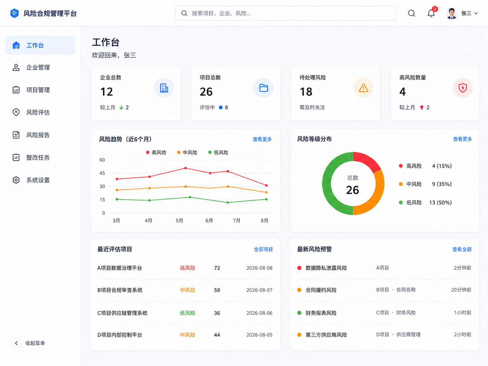
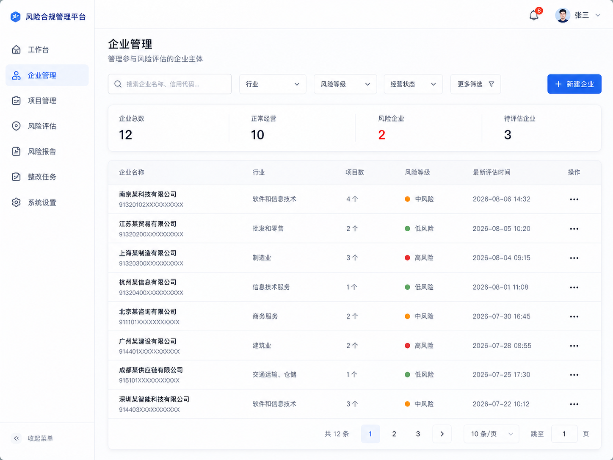
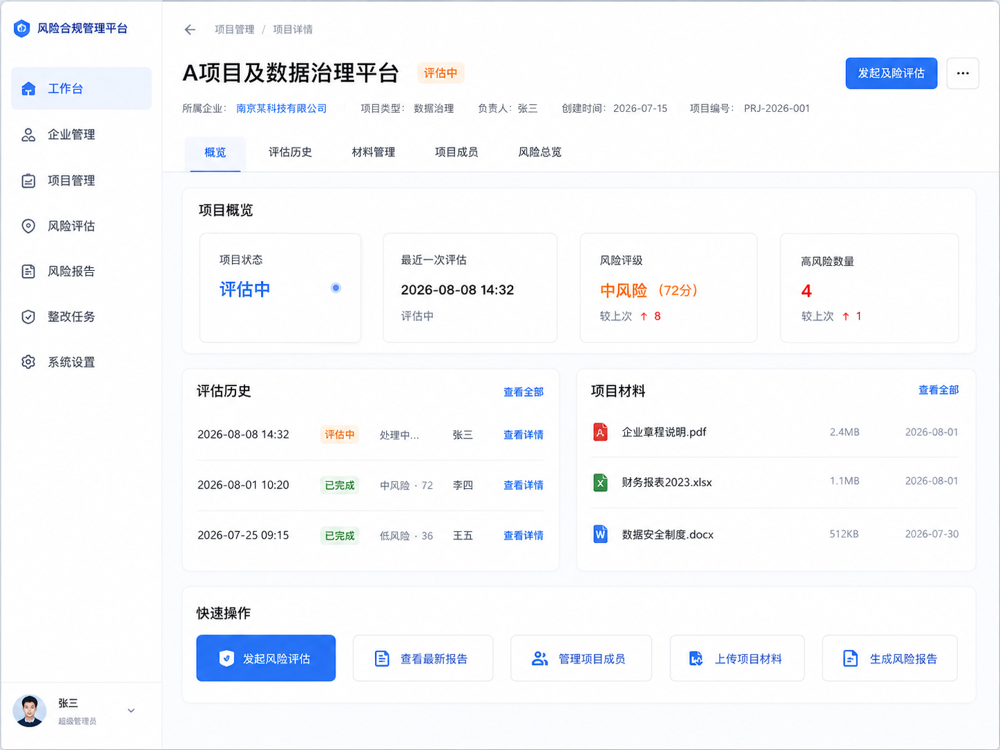
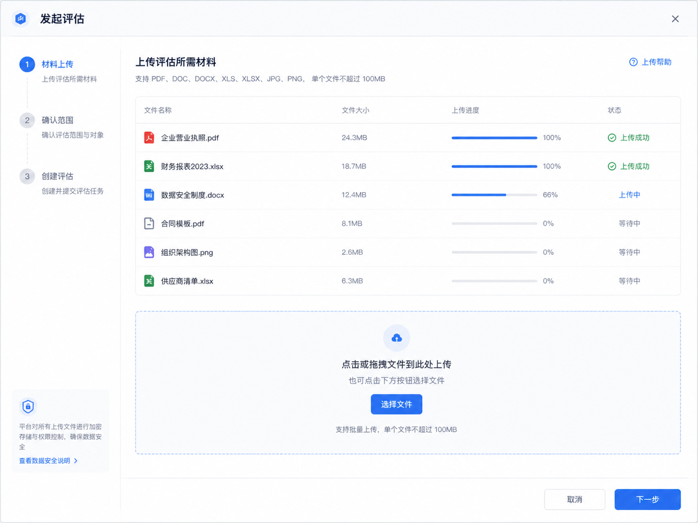
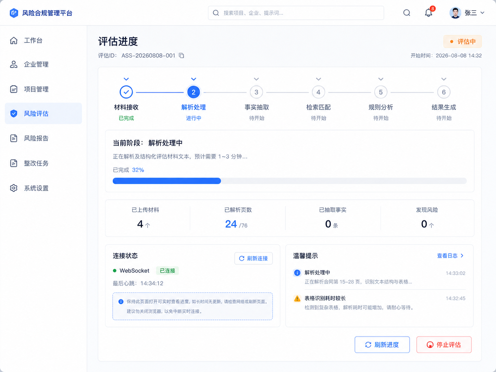
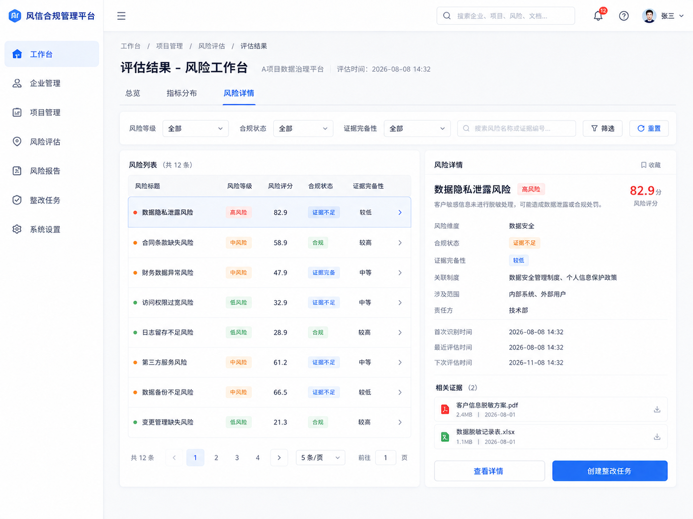
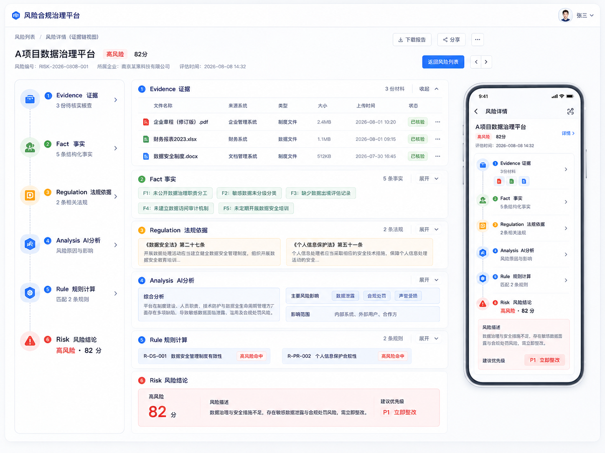

# 企业合规智能分析系统升级开发计划

> 制定日期：2026-08-13  
> 仓库基线：`main`，核对提交 `d650bf63101d`  
> 目标链路：`Document → Evidence → Fact → Retrieval → Reasoning → Rules → Risk → Explanation`

本文将总计划拆成可按顺序执行、可独立验收的阶段计划。每个阶段都使用统一的 12 节格式，明确目标、边界、数据契约、任务、依赖、验收和降级方案。

## 0. 执行约定

### 0.1 项目边界

- 本轮主要改造 `risk-warning-processing`、`risk-warning-knowledge`、`risk-warning-common`、`risk-warning-bert` 和 `risk-warning-report`。
- `risk-warning-gateway`、`risk-warning-org`、`risk-warning-notification` 原则上保持现有职责，只做主链联调所必需的兼容调整。
- Vue 前端位于独立仓库，本文件只定义它需要消费的接口、联调任务和验收结果，不把前端代码视为本仓库交付物。
- 保留现有 Kafka 主链，不在答辩前扩成大量 AI Topic。
- 保留旧分析链作为 Baseline 和降级路径，达到固定测试集门槛后再切换新链。

### 0.2 三人责任边界

| 角色 | 主要职责 | 最终证明 |
| --- | --- | --- |
| A：AI / RAG | Embedding、事实抽取、候选检索、Prompt、LLM 合规推理、效果评测 | 系统能够正确理解材料并给出受约束的合规分析 |
| B：Backend / Rule | Evidence 和 Behavior 契约、Processing 编排、Rule Engine、Kafka 接线、风险结果和证据链 API | 系统能够稳定产生确定性的指标结果和风险结果 |
| C：Frontend / Test | 固定测试集、Mock、前端证据展示、联调、E2E、Demo | 用户能够理解、回溯并验证分析结果 |

### 0.3 阶段顺序

| 阶段 | 日期 | 关闭条件 |
| --- | --- | --- |
| 计划 0：基线与契约冻结 | 8/13—8/17 | Baseline、公共 Schema、规则统计、固定测试集和 LLM JSON 验证全部完成 |
| 计划 1：Evidence 与事实抽取 | 8/18—8/24 | 一份 PDF 可生成带文件和页码定位的 Evidence，并形成可回指证据的 Structured Behavior |
| 计划 2：RAG 检索与首次垂直切片 | 8/25—8/31 | 真实 Evidence/Fact/Retrieval 接入 Mock AnalysisResult、临时规则和 Risk，并可在前端看到 |
| 计划 3：LLM 合规推理与 Rule Engine | 9/1—9/14 | 真实 LLM AnalysisResult 和既有 CalculationRule/RiskRule 决定最终 Risk |
| 计划 4：证据链、报告与前端联调 | 9/15—9/24 | 从上传到风险详情全链路运行，演示过程不手工修改 ES 或数据库 |
| 前端专项：生产级页面升级 | 8/13—9/24 | 统一应用壳层和状态模型，完成评估进度、风险证据链工作台、响应式和前端测试 |
| 计划 5：测试、对照实验与 RC | 9/25—10/1 | 固定测试集、旧新对照、稳定性验证和 Release Candidate 完成 |
| 计划 6：答辩交付冻结 | 10/1 后 | 只修 Bug、部署和准备答辩，不增加核心能力 |

### 0.4 全局质量门槛

1. 任何 Risk 都必须能够回溯到本次 Assessment 的 Behavior 和 Evidence，不能只按 `project_id` 混入历史上传材料。
2. 没有原文证据时不得自动判定高风险；没有法规引用时不得输出“违反某法规”的结论。
3. LLM 只输出结构化事实和语义判断，不直接决定最终分数和风险等级。
4. Rule Engine 必须记录输入、规则版本、中间结果和最终决策，确保同样输入可以复算。
5. Elasticsearch 改动必须验证 Mapping、实际写入覆盖率和查询结果，不能只验证 HTTP `200`。
6. 每个阶段优先交付一条可运行的纵向链路，禁止只形成彼此隔离的三个 Demo。

### 0.5 阶段 0 必须冻结的决策

- EvidenceChunk 的权威存储及 ES 检索副本策略；不得让两个存储各自成为独立真相源。
- LLM Provider、模型、Prompt 版本规则、超时、重试和降级策略。
- Embedding 模型、向量维度、版本字段和新旧索引迁移方式。
- Structured Behavior、RetrievalResult、AnalysisResult 的字段、枚举和 JSON Schema。
- 固定测试集的规模、Recall@K 门槛、置信度门槛和新链切换门槛。
- `analysisRunId / assessmentId / sourceDocumentId` 在 Kafka、持久化和查询中的数据隔离规则。

---

## 开发计划 0：基线冻结、公共契约与安全清理

### 1. 目标

冻结后续三人并行开发所需的代码基线、测试材料、公共对象、任务作用域和验收口径，并验证 LLM 能稳定返回可被 Java 8 代码解析的结构化 JSON。

完成后，团队应能用同一批输入复现旧系统结果，并围绕同一套 Schema 分别开发 Evidence、RAG、LLM、Rule Engine 和前端展示。

### 2. 当前现状

- 父工程包含 8 个 Maven 模块，外围用户、企业、项目、网关、通知和报告能力已经存在。
- 当前异步主链为 `behavior_processing_tasks → 文档处理/Spring Batch → indicator_calculation_tasks → BehaviorProcessingService → assessment_completed_events`。
- `BehaviorProcessingTaskMessage` 和 `IndicatorCalculationTaskMessage` 已包含 `assessmentId`，但文档处理、Behavior 持久化和后续查询没有完整保留本次评估的数据边界。
- `BehaviorProcessingService.fetchBehaviors` 当前按 `project_id` 读取 Behavior，可能把同一项目的历史上传材料混入本次评估。
- `Indicator` 已包含 `CalculationRule` 和 `RiskRule`，但真实规则数量、类型、缺失情况和可执行性尚未形成冻结清单。
- `LLMUtil` 存在硬编码凭据，必须吊销并迁移到环境变量或配置中心。
- `RiskLevelEnum` 的零风险边界以及旧评分链的其他确定性问题会污染 Baseline。
- `documents/es_mappings.json` 与部分 Java 向量字段命名存在不一致风险，必须以实际代码和运行时 Mapping 核对结果为准。

### 3. 本次范围

- 固定旧链的输入材料、Project、Assessment、召回结果、IndicatorResult、Risk 和典型错误案例。
- 统计 Indicator 的规则类型、规则缺失、风险规则覆盖率和不可执行样本。
- 冻结五个核心契约：`EvidenceChunk`、`StructuredBehavior`、`RetrievalResult`、`RiskAnalysisContext`、`AnalysisResult`。
- 冻结分析任务作用域字段，确保同一 Project 下不同 Assessment、上传批次和文件可以隔离。
- 建立 LLM Provider 最小调用，验证 `Prompt → JSON → Java DTO`。
- 吊销仓库中暴露的旧凭据，改用环境变量或 Nacos 等现有配置机制。
- 只修复会明显污染 Baseline 的确定性 Bug，并为其增加针对性测试。
- 固定前端 Mock、风险详情原型和三类测试案例。

### 4. 非本次范围

- 不实现完整 Evidence 抽取、RAG、LLM 合规推理或 Rule Engine。
- 不继续调优旧 BERT 模型和相似度阈值。
- 不重构所有微服务、Kafka Topic 或数据库。
- 不引入 Agent、Multi-Agent、Milvus、新训练流程或复杂前端页面。
- 不清理或删除历史 ES 索引和数据库数据。

### 5. 方案概述

```text
固定材料与评估
      ↓
运行旧链并保存 Baseline
      ↓
核对规则、Mapping 和数据边界
      ↓
冻结公共 Schema 与 Provider 协议
      ↓
使用固定 Prompt 验证结构化 JSON
      ↓
接口评审并锁定后续阶段输入输出
```

旧结果只作为比较基线，不作为新链设计的正确答案。新链必须保留 `legacyDecision` 与 `newDecision` 的可对照能力，切换前不能直接覆盖旧结果。

### 6. 涉及模块

- `risk-warning-common`：公共 DTO、枚举、消息作用域、Provider 抽象。
- `risk-warning-processing`：旧链 Baseline、Assessment 数据隔离现状、确定性边界 Bug。
- `risk-warning-knowledge`：Embedding/ES Mapping 和现有向量覆盖率基线。
- `risk-warning-report`：旧 Risk 触发结果和聚合边界基线。
- `risk-warning-bert`：现有模型能力和后续统一 Provider 接入点核对。
- `documents`、`test`：规则统计、固定材料、Baseline 与评测说明。
- 前端独立仓库：截图、Mock 类型、风险详情原型。

### 7. 核心数据 / 接口变化

本阶段以“冻结契约”为主，不提前完成所有实现。最小字段如下。

| 契约 | 必须包含 |
| --- | --- |
| `AnalysisTaskScope` | `analysisRunId`、`userId`、`projectId`、`assessmentId`、`sourceDocumentIds`、`traceId` |
| `EvidenceChunk` | `id`、任务作用域、文件标识、文件名、页码、段序号、原文、位置或文本哈希 |
| `StructuredBehavior` | 主体、行为、对象、状态、时间、定量值、单位、事实描述、置信度、`evidenceIds`、抽取版本 |
| `RetrievalResult` | 候选类型、候选 ID、得分、排名、命中的过滤条件、检索模型版本、关联 Behavior ID |
| `RiskAnalysisContext` | 企业/项目背景、Structured Behavior、Evidence、候选 Indicator 和 Regulation |
| `AnalysisResult` | 适用性、法规要求、企业事实、合规状态、差距、数值或状态、置信度、理由、Evidence/Regulation 引用、模型和 Prompt 版本 |
| `AiModelProvider` | 事实抽取、合规分析、Embedding 的稳定调用边界；业务代码不得依赖静态密钥或供应商专用响应 |

Kafka Topic 暂不变化；若消息需新增字段，必须保持旧消费者可读，并明确缺失字段时的拒绝或兼容策略。

### 8. 开发任务拆分

- [x] `P0-01`（C，B 协助）冻结测试 PDF、Project、Assessment 和三类案例：明确不合规、明确合规、证据不足。→ `documents/plan0/baseline/test-cases.md`
- [x] `P0-02`（B）记录旧链的 Behavior、Indicator/Regulation 召回、IndicatorResult、Risk 和错误案例。→ `documents/plan0/baseline/p0-02-baseline.md`
- [ ] `P0-03`（B）核对 `projectId / assessmentId / sourceDocumentId` 的传递与查询边界，形成隔离改造清单。
- [ ] `P0-04`（B）统计 Indicator 总数、Binary、Range、无 CalculationRule、有/无 RiskRule 和不可执行规则样本。
- [ ] `P0-05`（A、B）定义并评审五个核心 Schema、枚举、校验规则和版本字段。
- [ ] `P0-06`（A）完成固定 Prompt 的结构化 JSON 最小验证，保存成功与失败样本。
- [ ] `P0-07`（B）引入 Provider 配置边界，吊销并替换硬编码凭据；仓库和日志不得再出现有效密钥。
- [ ] `P0-08`（B）为零风险聚合等已确认的确定性 Bug 添加失败测试并修复。
- [ ] `P0-09`（A、B）核对 Java 字段、文档 Mapping 和运行时 ES Mapping，冻结向量字段、维度和版本策略。
- [ ] `P0-10`（C）完成旧结果截图、Evidence/AnalysisResult 前端类型和风险详情 Mock。
- [ ] `P0-11`（全员）召开接口评审，记录已冻结项、未决项、负责人和最晚决策日期。

### 9. 依赖关系

- 前置依赖：当前 `main` 可构建；固定测试材料可合法使用；本地 ES/PostgreSQL/Kafka/BERT 或替代 Mock 可启动。
- 本阶段不依赖计划 1—5。
- 本阶段完成后解锁计划 1 的 Evidence/Fact、计划 2 的 RAG、计划 3 的 AnalysisResult/Rule Engine 和计划 4 的前端契约。
- 五个核心 Schema 未冻结时，三条开发线不得各自创建同名但不兼容的对象。

### 10. 验收标准

1. 固定测试集包含三类案例，每个案例有唯一 ID、输入文件、期望事实、期望法规/指标和期望风险状态。
2. Baseline 记录能够在同一环境重跑，并保存旧召回、IndicatorResult、Risk 数量和典型错误证据。
3. Indicator 规则统计可以通过脚本或查询复现，报告中不存在“约有”“大部分”等无法验证的结论。
4. 五个核心 Schema 均有字段、必填性、枚举、示例 JSON、生产者、消费者和版本规则。
5. 固定 Prompt 至少连续验证 10 次；每次保留原始响应、校验结果和重试结果，失败不会被静默吞掉。
6. `analysisRunId / assessmentId / sourceDocumentId` 的传递和查询规则已书面冻结，明确禁止只按 `project_id` 读取本次输入。
7. 仓库、配置样例和日志中不再存在有效硬编码凭据，旧凭据已完成吊销或轮换。
8. 会污染 Baseline 的已确认 Bug 均有回归测试，测试先失败后通过。

### 11. 测试方式

- 使用固定 PDF 运行旧链，导出同一 Assessment 的 Behavior、召回、IndicatorResult 和 Risk。
- 对规则数据运行可重复统计，人工抽查每类至少 5 条原始规则。
- 用 JSON Schema 或 DTO 校验固定 LLM 输出，覆盖正常、缺字段、错枚举、额外文本、超时和无效 JSON。
- 用两个相同 `projectId`、不同 `assessmentId` 的样本验证数据隔离预期。
- 对零风险集合运行聚合单元测试，确认不会产生错误风险等级。
- 检查实际 ES Mapping 与写入字段，记录文档 Mapping 的差异。

### 12. 风险与降级

- 若 LLM Provider 尚不稳定，保留录制的固定 JSON 响应作为后续联调 Stub，但 Schema 和失败语义必须先冻结。
- 若真实规则质量不足，先分类为“可执行、需校正、缺失”，计划 3 只自动执行已确认可执行的 Binary/Range/Static Threshold。
- 若本地基础设施不能统一启动，先用固定导出数据完成契约和单元测试，但不得把 Mock 结果当作端到端验收。
- 最低交付版本：Baseline、五个 Schema、规则统计、固定测试集、无硬编码密钥和一条可解析的 LLM JSON 调用全部完成。

---

## 开发计划 1：Evidence 与 Structured Behavior

### 1. 目标

把当前“文档分页后写成纯文本、每行生成空壳 Behavior”的流程升级为可追溯的材料理解链：

```text
Document → EvidenceChunk → Fact Extraction → Structured Behavior
```

完成后，每条 Structured Behavior 都能回指本次 Assessment 中的原始文件、页码和 Evidence，且包含后续检索和规则计算所需的事实字段。

### 2. 当前现状

- `DocumentProcessingService` 已能调用 `ContentExtractor` 获取 `TextSegment`，后者已经包含 `pageNumber`。
- `DocumentProcessingService` 随后把内容写入 `.txt` 中间文件，页码、文件标识和段落位置没有进入后续 Batch。
- `LineProcessor` 创建的 Behavior 包含空标签、空状态等默认值。
- `LineRangeItemWriter` 主要补充 `tags/type/dimension`，代码明确说明分类服务不返回 `status`；定量值也没有稳定抽取。
- `Behavior` 当前只有 `projectId` 和事实描述等基础字段，没有 Assessment、源文件和 Evidence 关联。
- 现有 Spring Batch 和 Kafka 链可运行，适合保留作兼容路径，不适合继续承载新事实抽取职责。

### 3. 本次范围

- 定义并持久化 `EvidenceChunk`，保留文件、页码、段序号、原文和稳定 ID。
- 将 `assessmentId`、源文件或上传批次标识贯穿文档处理、事实抽取、Behavior 持久化和查询。
- 建立 `EvidenceExtractionService` 与 `FactExtractionService`，通过 Provider 获取结构化事实。
- 对 LLM 输出做 Schema 校验、枚举归一化、数值/单位校验、重试和明确降级。
- 将 Structured Behavior 映射到演进后的 Behavior 存储，并保存 `evidenceIds`、置信度和抽取版本。
- 保留旧 `LineProcessor / LineRangeItemWriter` 作为兼容链，避免在新链稳定前直接删除。
- 提供 Evidence 和 Structured Behavior 的查询接口或可供前端 Mock 的 DTO。
- 增加针对文档定位、事实抽取、数据隔离和 ES 实际写入的测试。

### 4. 非本次范围

- 不做 Indicator/Regulation 检索和 RAG 评测。
- 不让 LLM 判断风险、分数或法规是否适用。
- 不实现 Rule Engine。
- 不删除 Spring Batch、旧 Behavior 分类链或旧 ES 字段。
- 不重做 OCR、复杂表格识别和多模态材料理解；只复用现有文档解析能力。
- 不修改 Report、Notification 和完整风险页面。

### 5. 方案概述

```text
BehaviorProcessingTaskMessage
  projectId + assessmentId + filePaths
                ↓
DocumentProcessingService
                ↓
ContentExtractor.TextSegment
  text + pageNumber
                ↓
EvidenceExtractionService
  生成稳定 EvidenceChunk
                ↓
FactExtractionService
  LLM 只抽取“材料里发生了什么”
                ↓
Schema 校验 / 归一化 / 降级
                ↓
Structured Behavior
                ↓
Behavior 持久化并回指 Evidence
```

同一文档重复处理时，使用由任务作用域、源文件和文本哈希组成的幂等键，避免重复生成 Behavior。旧 Batch 路径保留，但新路径的数据必须带完整作用域。

### 6. 涉及模块

- `risk-warning-common`：Evidence、Structured Behavior、错误对象、任务作用域和 DTO。
- `risk-warning-processing`：文档解析接线、Evidence/Fact 服务、Behavior 写入、Kafka 任务作用域。
- `risk-warning-bert`：LLM/模型 Provider 的实现入口或适配层，具体归属以计划 0 决议为准。
- `risk-warning-knowledge`：若 Evidence/Behavior 的 ES 写入复用现有 Repository，则只做必要适配。
- `documents`：ES Mapping、数据字典和接口示例同步。
- 前端独立仓库：Evidence + Behavior Mock 展示。

### 7. 核心数据 / 接口变化

#### EvidenceChunk

| 字段 | 说明 |
| --- | --- |
| `id` | 稳定证据 ID |
| `analysisRunId/projectId/assessmentId` | 本次分析作用域 |
| `sourceDocumentId/sourceFileName` | 来源文件定位 |
| `pageNumber/segmentIndex` | 页码和页内段序号 |
| `charStart/charEnd` | 能可靠获得时保存；无法获得时允许为空 |
| `text/textHash` | 原文及完整性校验 |
| `createdAt` | 生成时间 |

#### StructuredBehavior / Behavior 扩展

| 字段 | 说明 |
| --- | --- |
| `subject/action/object` | 企业事实三元结构 |
| `status/occurredAt` | 行为状态和时间 |
| `quantitativeValue/unit` | 定量事实及单位 |
| `description` | 不脱离原文的事实描述 |
| `confidence` | 抽取置信度 |
| `evidenceIds` | 至少一个 Evidence 引用 |
| `extractionModel/extractionPromptVersion` | 可审计版本 |
| `assessmentId/sourceDocumentId` | 隔离本次分析输入 |

#### 服务接口

- `EvidenceExtractionService.extract(scope, document)`：返回 Evidence 列表和解析错误。
- `FactExtractionService.extract(scope, evidenceChunks)`：返回 Structured Behavior 列表、失败项和调用元数据。
- Behavior 查询接口必须接收 `assessmentId` 或 `analysisRunId`，不得仅按 `projectId` 查询本次分析输入。

### 8. 开发任务拆分

- [ ] `P1-01`（B）为 `DocumentProcessingService` 增加任务作用域，保留 `TextSegment.pageNumber` 和源文件身份。
- [ ] `P1-02`（B）实现 `EvidenceChunk` 对象、ID/哈希策略、持久化和查询。
- [ ] `P1-03`（B）更新 Behavior 模型、ES Mapping 和 Repository，使其保存 Assessment、证据引用和抽取元数据。
- [ ] `P1-04`（A）设计 Fact Extraction Prompt 和 JSON Schema，只抽取事实，不输出风险判断。
- [ ] `P1-05`（A、B）实现 `FactExtractionService`、Provider 适配、校验、重试、错误分类和显式降级。
- [ ] `P1-06`（B）实现幂等写入和同一 Project 下不同 Assessment/文件的隔离查询。
- [ ] `P1-07`（B）保留旧 Batch 兼容入口，明确新旧 Behavior 的版本或来源标识。
- [ ] `P1-08`（C）完成 Evidence 原文、文件名、页码、Evidence ID 和 Behavior 结果的 Mock 页面。
- [ ] `P1-09`（C、A）标注固定材料的期望事实，用于字段级抽取验证。
- [ ] `P1-10`（全员）用一份真实 PDF 完成上传到 Structured Behavior 的阶段验收。

### 9. 依赖关系

- 依赖计划 0 的任务作用域、EvidenceChunk、StructuredBehavior、Provider 和 JSON Schema 冻结。
- 依赖现有文档解析可读取固定 PDF。
- 完成本阶段后解锁计划 2 的检索 Query Builder、计划 3 的 RiskAnalysisContext 和计划 4 的证据链展示。
- 若 Evidence 无法稳定定位到文件和页码，禁止进入计划 3 的自动高风险判断。

### 10. 验收标准

1. 固定 PDF 上传后能生成非空 EvidenceChunk 列表，每个 Chunk 均有文件标识、正确页码、段序号和原文。
2. 每条 Structured Behavior 至少引用一个真实存在的 Evidence ID，引用的原文能支持该事实描述。
3. 主体、行为、对象、状态、时间、数值、单位和置信度按 Schema 输出；原文不存在的字段为缺失状态，不能臆造默认值。
4. 同一文件在同一 AnalysisRun 重试不会重复生成等价 Evidence 和 Behavior。
5. 同一 Project 下两个 Assessment 的 Behavior 查询结果互不混入。
6. LLM 返回无效 JSON、错枚举或错误单位时，系统会校验失败、重试或标记降级，不会把无效数据写成正常事实。
7. ES Mapping 更新后，通过实际查询确认新增字段已经持久化；测试不仅检查接口 `200`。
8. 旧 Batch 入口仍可运行，且新旧记录可以通过来源/版本字段区分。

### 11. 测试方式

- 单元测试：页码保留、Evidence ID/哈希、Schema 校验、状态枚举、数值和单位归一化、幂等逻辑。
- Provider 契约测试：正常 JSON、Markdown 包裹、缺字段、错类型、超时、限流和空响应。
- ES 集成测试：创建测试索引、写入 Evidence/Behavior、按 `assessmentId` 查询、检查新增字段和引用完整性。
- 数据隔离测试：对同一 Project 连续上传两份文件并创建两个 Assessment，确认第二次分析不读取第一次 Behavior。
- 人工抽查：对固定 PDF 每页抽查 Evidence，并将 Structured Behavior 与原文逐项核对。
- 前端 Mock：点击 Behavior 可以定位并高亮对应文件页码和 Evidence 文本。

### 12. 风险与降级

- 若字符级位置无法可靠获得，最低版本保留文件、页码、段序号和完整原文，不因字符偏移阻塞主链。
- 若 LLM Fact Extraction 不稳定，先限制固定材料类型和字段集合，并允许人工维护固定 JSON Stub；不得退回“每行直接当事实”。
- 若 Evidence 权威存储尚未就绪，可先使用单一持久化实现完成垂直切片，但必须保存稳定 ID、来源和哈希，且禁止出现两个互不一致的真相源。
- 最低交付版本：一份固定 PDF 能生成可回页的 Evidence 和可回指 Evidence 的 Structured Behavior。

---

## 开发计划 2：RAG 检索底座与第一次端到端垂直切片

### 1. 目标

将 Structured Behavior 关联到正确的 Indicator 和 Regulation，并在 8 月 31 日前完成第一条跨成员、跨模块、前后端可见的端到端垂直切片。

本阶段允许 `AnalysisResult` 使用固定 JSON，重点验证真实数据和接口能完整流动，而不是提前追求复杂推理效果。

### 2. 当前现状

- `EsVectorizationUtil` 已有遍历 ES、批量向量化、校验维度和批量写回的基础骨架。
- 当前 Indicator 主要向量化 `name`，Regulation 向量化 `full_text`，Behavior 向量化 `description`。
- 当前通用 BERT CLS 并非检索专用 Embedding，旧检索还叠加标签和固定阈值，容易受空标签影响。
- Indicator 已有 `description/dimension/industry/region/calculationRule/riskRule`，但没有形成统一 `retrieval_text`。
- Regulation 数据已经接近条款粒度，本轮没有必要另建复杂法规 Chunk 工程。
- Enterprise 和 Project 已有行业、地域、面向对象等背景字段，可以用于 Metadata Filter。
- 当前链路能生成 IndicatorResult 和 Risk，但结果仍由旧相似度、定性表和统一阈值主导。

### 3. 本次范围

- 接入检索专用中文 Embedding，并记录模型、维度和向量版本。
- 为 Indicator 构造 `retrieval_text`，包含名称、描述、维度、行业、地区和可读规则说明。
- 对 Regulation 的 `full_text` 使用新 Embedding，不额外进行复杂切块。
- 为 Structured Behavior 构造检索 Query，并先执行行业、地域、适用对象等 Metadata Filter。
- 基于 Elasticsearch KNN 实现 Indicator 和 Regulation 候选召回。
- 返回标准 `RetrievalResult`，保留候选 ID、排名、得分、过滤条件和模型版本。
- 建立至少几十条 Behavior→Indicator/Regulation 的标注集，并测量 Recall@5、Recall@10。
- 使用 Mock AnalysisResult 和临时规则，把真实 Document/Evidence/Fact/Retrieval 接到 IndicatorResult、Risk 和前端。
- 保留旧向量字段/索引作为 Baseline 和降级路径，使用新字段或索引避免不可恢复覆盖。

### 4. 非本次范围

- 不同时引入 BM25、Reranker、LLM Rerank、Query Expansion 和混合检索。
- 不做 Milvus 迁移。
- 不做法规二次 Chunk 工程。
- 不实现真实 LLM 合规推理和完整 Rule Engine。
- 不优化复杂缓存、分布式检索或在线学习。
- 不删除旧向量和旧检索路径。

### 5. 方案概述

```text
Structured Behavior
        ↓
Query Builder
        ↓
Enterprise / Project Metadata Filter
        ↓
Elasticsearch KNN
   ├── Indicator retrieval_vector
   └── Regulation full_text_vector_v2
        ↓
RetrievalResult
        ↓
Mock AnalysisResult
        ↓
临时规则适配
        ↓
IndicatorResult → Risk → Frontend
```

第一版检索只采用“专用 Embedding + ES KNN + Metadata Filter”。先确保正确候选能进入 Top-K，再决定是否需要 P1 的混合检索和 Reranker。

### 6. 涉及模块

- `risk-warning-common`：RetrievalResult、模型版本、过滤条件和垂直切片 Stub 契约。
- `risk-warning-knowledge`：文本构造、Embedding、批量向量化、ES KNN 和评测入口。
- `risk-warning-processing`：Query Builder、企业背景加载、检索编排、Mock AnalysisResult 和临时规则接线。
- `risk-warning-bert`：Embedding Provider 或模型服务适配。
- `risk-warning-report`：只做垂直切片所需的结果读取，不在本阶段完成职责重构。
- `documents`、`test`：Mapping、标注集和 Recall 评测说明。
- 前端独立仓库：展示垂直切片结果。

### 7. 核心数据 / 接口变化

| 对象/字段 | 变化 |
| --- | --- |
| Indicator | 新增或建立 `retrieval_text`、`retrieval_vector`、`embedding_model`、`embedding_version` |
| Regulation | 新增版本化检索向量字段；保留 `full_text` 为可引用原文 |
| Structured Behavior | 增加确定性的 Query Builder，不直接把未经处理的整段 JSON 作为查询文本 |
| `RetrievalFilter` | 行业、地域、适用对象、项目面向用户及必要的维度过滤 |
| `RetrievalResult` | `candidateType/candidateId/score/rank/matchedFilters/embeddingVersion/behaviorId` |
| `RetrievalService` | 分别返回 Indicator 候选和 Regulation 候选；Top-K、候选数和最小分数配置化 |
| 评测记录 | 样本 ID、期望候选、Top-K 结果、Recall@5、Recall@10、模型/索引版本 |

ES Mapping 迁移必须采用新字段、测试索引或别名切换等可回退方式，不能直接覆盖唯一旧向量后再尝试比较。

### 8. 开发任务拆分

- [ ] `P2-01`（A）选择并验证检索专用中文 Embedding，冻结模型、维度、最大输入和批量大小。
- [ ] `P2-02`（A、B）实现 Indicator `retrieval_text` 构造规则并为 Regulation 生成新向量。
- [ ] `P2-03`（B）更新 ES Mapping/索引版本，提供批量回填、覆盖率检查和失败重试。
- [ ] `P2-04`（A、B）实现 Structured Behavior Query Builder 和 Metadata Filter。
- [ ] `P2-05`（A、B）实现 Indicator/Regulation KNN RetrievalService 和标准 RetrievalResult。
- [ ] `P2-06`（C、A）标注至少 30 条 Behavior→正确 Indicator/Regulation 的检索评测集。
- [ ] `P2-07`（A）实现 Recall@5、Recall@10 评测脚本并与旧链结果对照。
- [ ] `P2-08`（B）把 Retrieval 接入 `indicator_calculation_tasks` 后的 Processing 流程，保持现有 Topic 数量不扩张。
- [ ] `P2-09`（B）接入固定 AnalysisResult 和临时规则，产出真实 IndicatorResult 和 Risk。
- [ ] `P2-10`（C）在前端显示本次 Assessment 的风险及其 Evidence、Behavior、候选 Indicator/Regulation。
- [ ] `P2-11`（全员）完成 8 月 31 日垂直切片演示并记录阻塞项。

### 9. 依赖关系

- 依赖计划 0 的 Embedding/Schema/评测门槛决议和计划 1 的 Structured Behavior、Evidence、Assessment 隔离。
- 依赖 Indicator/Regulation 基础数据可读取，且实际 ES Mapping 可安全升级。
- 本阶段完成后解锁计划 3 的真实 LLM Reasoning 和 Rule Engine。
- 若 8 月 31 日垂直切片未完成，所有 P1 检索优化、复杂前端和非核心重构暂停。

### 10. 验收标准

1. Indicator 和 Regulation 新向量的 Mapping、维度、模型版本和实际写入覆盖率可查询；失败文档有明确列表。
2. 检索请求先应用冻结的 Metadata Filter，再执行 KNN；测试能证明不适用行业/地域的候选被排除或明确降权。
3. 至少 30 条人工标注样本能够一键计算 Recall@5 和 Recall@10，结果记录模型、索引和数据版本，并达到计划 0 冻结的门槛。
4. 每个 RetrievalResult 都能回指本次 Assessment 的 Behavior，并包含真实存在的 Indicator/Regulation ID。
5. 一份固定材料能真实走完 `Document → Evidence → StructuredBehavior → Retrieval → Mock AnalysisResult → Rule → IndicatorResult → Risk`。
6. 垂直切片中 A 的输出被 B 的流程真实消费，C 通过后端接口看到结果，不允许使用三个互不相连的本地 Demo。
7. 演示不需要手工向 ES 或 PostgreSQL 填造结果。
8. 旧向量/旧检索仍可切回，且新旧结果可以对照。

### 11. 测试方式

- `EsVectorizationUtil` 针对性测试：文本构造、批量大小、维度错误、空文本、部分 Bulk 失败和覆盖率。
- ES 集成测试：新索引 Mapping、真实向量写入、Metadata Filter、KNN Top-K 和版本字段。
- 离线检索评测：固定标注集计算 Recall@5/10，并输出未召回案例。
- 数据隔离测试：同一 Project 的历史 Behavior 不得进入本次 Assessment 检索。
- 垂直切片集成测试：固定 PDF 进入 Kafka 后，轮询直到 Risk 可查询，并核对 Evidence/候选引用。
- 前端联调：按 Assessment 请求数据，刷新页面后仍能看到同一持久化结果。

### 12. 风险与降级

- 若新 Embedding 效果暂未达到门槛，先保留 Top-K 较宽的候选集交给计划 3 的受约束 LLM 分析，同时记录降级标记；不得用相似度直接判风险。
- 若全量重向量化耗时过长，只处理固定行业和答辩数据集，但必须公开覆盖范围。
- 若企业背景字段存在空值，Metadata Filter 采用“缺失时不过度过滤”的显式规则，并记录实际使用的过滤条件。
- 最低交付版本：单一行业、ES KNN、Indicator/Regulation 两类候选、30 条评测集和一条使用 Mock AnalysisResult 的真实垂直切片。

---

## 开发计划 3：LLM 合规推理、Rule Engine 与主链职责重构

### 1. 目标

用真实 LLM AnalysisResult 替换垂直切片中的固定 JSON，并让既有 CalculationRule 和 RiskRule 真正决定 IndicatorResult 与 Risk。

完成后，最终风险不再由旧 SimilarityCalculator、固定定性六值表或 Report 的统一 `scoreRatio < 0.5` 单独决定。

### 2. 当前现状

- `BehaviorProcessingService` 同时承担 Behavior 获取、Indicator/Regulation 召回、相似度计算、法规评分、指标聚合、结果保存和 Assessment 完成，职责过重。
- 当前服务按 Behavior 执行 KNN 和相似度计算，结果与事实、证据和法规适用性没有明确分层。
- `CalculationRule` 已支持 Binary/Range，`RiskRule` 已包含 StaticThreshold/AdjustmentFactor 等结构，但主链尚未完整执行。
- PostgreSQL 的 `t_indicator_result` 已有规则类型、计算详情、匹配 Behavior 和 `risk_triggered` 字段，可以承载可复算结果。
- `AssessmentServiceImpl` 当前统一按 `scoreRatio < 0.5` 创建 Risk，Report 实际参与了风险决策。
- 当前 Risk 对象已经包含描述、影响、责任主体、整改措施和关联指标等字段，但多个字段缺少可信来源。

### 3. 本次范围

- 实现受约束的 LLM Compliance Reasoning，输入企业背景、事实、Evidence 和候选 Indicator/Regulation。
- 输出并校验结构化 AnalysisResult：适用性、法规要求、企业事实、合规差距、置信度、理由和引用。
- 建立 Rule Engine，第一版支持 Binary Rule、Range Rule 和 Static Risk Threshold。
- 将 AnalysisResult 转换为明确的 Rule Input，不让规则引擎解析自由文本。
- 记录规则版本、输入、计算中间值、冲突和最终决定。
- 将 `BehaviorProcessingService` 渐进收敛为编排器，拆出 Retrieval、LLM Analysis 和 Rule Engine 服务。
- 保持现有 Kafka Topic；`indicator_calculation_tasks` 消费后完成 Retrieval→LLM→Rule Engine。
- 调整 Report 边界：Report 汇总和展示已产生的 Risk，不再使用统一阈值二次决定是否风险。
- 实现 LLM 失败、低置信度、证据不足和规则冲突的明确状态与降级。

### 4. 非本次范围

- 不一次性重写整个 `BehaviorProcessingService`。
- 不扩成十几个 AI Kafka Topic。
- 不支持复杂 AdjustmentFactor、规则 DSL、在线规则编辑器和全量规则自动修复。
- 不让 LLM 直接输出最终风险等级或分数。
- 不加入 Agent、自动工具调用、复杂 Reranker 或新 AI 框架。
- 不在本阶段完成全部前端样式和报告产品化。

### 5. 方案概述

```text
RiskAnalysisOrchestrator
        │
        ├── 加载 Task Scope / Enterprise Context
        ├── 加载 Structured Behavior + Evidence
        ├── RetrievalService
        ├── ComplianceAnalysisService
        │      └── LLM → AnalysisResult → Schema 校验
        ├── RuleEngine
        │      ├── CalculationRule
        │      └── RiskRule
        ├── 保存 IndicatorResult / Risk / 审计信息
        └── 完成 Assessment 并发送既有事件
```

关键决策规则：

- 无 Evidence 引用：不得自动判高风险。
- 无 Regulation 引用：不得输出明确违规结论。
- 低置信度或证据冲突：输出 `NEEDS_REVIEW` 或 `INSUFFICIENT_EVIDENCE`，不强行二选一。
- LLM 语义结论与确定性规则冲突：以已审核规则为准，并记录冲突。
- Provider 不可用：记录 `DEGRADED`，按冻结策略使用 Stub/旧链或停止自动判定，不能伪装为正常新链结果。

### 6. 涉及模块

- `risk-warning-common`：AnalysisResult、RuleInput、决策状态、错误和审计 DTO。
- `risk-warning-processing`：Orchestrator、ComplianceAnalysisService、Rule Engine、IndicatorResult/Risk 写入和 Kafka 接线。
- `risk-warning-knowledge`：RetrievalService 的稳定接口和候选内容加载。
- `risk-warning-bert`：LLM Provider 适配、调用元数据和错误分类。
- `risk-warning-report`：移除统一风险判定职责，改为消费已决定的 `riskTriggered/riskLevel`。
- `risk-warning-notification`：继续消费完成结果，仅在消息契约必要时兼容。
- `documents`：AnalysisResult、规则输入输出和失败状态文档。

### 7. 核心数据 / 接口变化

#### AnalysisResult

| 字段 | 说明 |
| --- | --- |
| `behaviorId/evidenceIds` | 被分析的事实和证据 |
| `indicatorId/regulationIds` | 候选及最终采用的法规引用 |
| `applicable` | 法规是否适用，允许未知 |
| `requirement` | 法规要求的结构化摘要 |
| `enterpriseFact` | 由 Evidence 支持的企业事实 |
| `complianceStatus` | `COMPLIANT/NON_COMPLIANT/INSUFFICIENT_EVIDENCE/NEEDS_REVIEW` |
| `gapType/gapValue/gapUnit` | 状态或定量差距 |
| `confidence/reasoning` | 置信度和简明理由 |
| `modelVersion/promptVersion` | 调用版本 |

#### RuleInput / RuleEvaluationResult

- RuleInput 只包含经校验的布尔状态、数值、单位、Evidence 完整性、AnalysisResult 状态和目标 Indicator 规则。
- RuleEvaluationResult 包含规则类型、输入快照、计算步骤、得分、最大分、是否触发风险、风险等级、规则版本和冲突信息。
- `t_indicator_result.calculation_details` 保存可复算的结构化计算详情，不只保存最终分数。

#### 服务边界

- `ComplianceAnalysisService.analyze(context)`：返回校验后的 AnalysisResult 或明确失败状态。
- `RuleEngine.evaluate(indicator, analysisResults)`：返回 RuleEvaluationResult。
- `RiskAnalysisOrchestrator.run(scope)`：只负责编排、状态、异常、批处理和结果聚合。
- Report 读取 `riskTriggered` 和已确定的风险信息，不再重新执行统一阈值。

### 8. 开发任务拆分

- [ ] `P3-01`（A）设计 Compliance Reasoning Prompt，明确引用、适用性、差距和证据不足输出。
- [ ] `P3-02`（A、B）实现 AnalysisResult JSON Schema、Java DTO、校验、重试和 Provider 错误映射。
- [ ] `P3-03`（B）定义 RuleInput 与 RuleEvaluationResult，建立规则可复算记录。
- [ ] `P3-04`（B）以测试驱动方式实现 Binary Rule。
- [ ] `P3-05`（B）以测试驱动方式实现 Range Rule，验证单位、边界和缺失值。
- [ ] `P3-06`（B）实现 Static Risk Threshold，替换 Report 统一 0.5 阈值的决策职责。
- [ ] `P3-07`（B）实现证据不足、低置信度、LLM/规则冲突和 Provider 降级策略。
- [ ] `P3-08`（B）从 `BehaviorProcessingService` 拆出 Retrieval、Compliance Analysis 和 Rule Engine 接口，建立 Orchestrator。
- [ ] `P3-09`（B）保持现有 Kafka Topic，将真实 Retrieval→LLM→Rule Engine 接入 `indicator_calculation_tasks`。
- [ ] `P3-10`（B）修改 Report，使其汇总已决定的 Risk，不再二次使用统一阈值产生风险。
- [ ] `P3-11`（A、C）用固定案例复核 LLM 适用性、法规引用和证据不足判断。
- [ ] `P3-12`（全员）完成 9 月 14 日真实 LLM + Rule Engine 全链验收。

### 9. 依赖关系

- 依赖计划 1 的可靠 Evidence/Structured Behavior 和计划 2 的候选 RetrievalResult。
- 依赖计划 0 的可执行规则清单、AnalysisResult Schema、置信度和降级决议。
- 本阶段输出解锁计划 4 的证据链 API、风险详情和报告联调。
- Report 职责迁移必须等 Processing 能稳定持久化 `riskTriggered/riskLevel` 后切换，避免出现无人决定风险的窗口。

### 10. 验收标准

1. 固定输入能产生通过 Schema 校验的真实 AnalysisResult，且 Evidence/Regulation 引用均能查到原对象。
2. 明确合规、明确不合规、证据不足三类案例分别得到可区分的状态，证据不足不会自动变成违规。
3. Binary、Range、Static Threshold 均有正常、边界、缺失和错误输入测试，结果可由保存的计算详情复算。
4. 最终 Risk 的触发和等级来自 RuleEvaluationResult，不再由旧相似度、定性常量表或 Report 统一 0.5 阈值独立决定。
5. `BehaviorProcessingService` 或新 Orchestrator 只保留流程编排，检索、LLM 和规则逻辑具有独立接口和测试。
6. Provider 超时、限流、无效 JSON 和低置信度会生成明确失败/降级状态，不会将 Assessment 错误标记为正常完成。
7. 同一输入和同一规则版本重复执行得到相同 Rule 结果；重复消息不会重复生成 Risk。
8. 一份真实材料能运行完整 `Evidence → Fact → RAG → LLM → Rule → Risk`，且所有阶段使用同一 Assessment 作用域。

### 11. 测试方式

- AnalysisResult 契约测试：正常、错误引用、无 Evidence、无法规、证据冲突、低置信度和无效 JSON。
- Rule Engine 单元测试：Binary 真/假、Range 边界/越界/单位不匹配、Static Threshold 临界值。
- Orchestrator 测试：服务调用顺序、阶段失败、重试、幂等、Assessment 状态和完成事件。
- Report 回归测试：已触发/未触发 Risk 完全服从 Processing 结果，删除统一阈值后统计仍正确。
- Kafka 集成测试：同一消息重放不会重复写结果，失败不会发送错误的完成事件。
- 固定材料 E2E：检查 AnalysisResult、calculation_details、Risk、Evidence 和 Regulation 引用。

### 12. 风险与降级

- 若部分 Indicator 规则不可执行，只自动处理计划 0 确认的 Binary/Range/Static Threshold，其余标记 `NEEDS_REVIEW`，不得套用错误兜底公式。
- 若 LLM 稳定性不足，限制 Prompt、候选数量和输出字段，使用一次重试及固定 Stub 完成联调；正式结果必须标记调用来源。
- 若 Orchestrator 重构风险过大，先在现有 `BehaviorProcessingService` 外提取三个独立服务并委托调用，不做大规模类结构重写。
- 最低交付版本：固定行业、三类案例、真实 AnalysisResult、Binary/Range/Static Threshold 和可回证据的 Risk。

---

## 开发计划 4：证据链、报告与前端全链联调

### 1. 目标

把已经可用的智能分析能力产品化，使用户能从 Risk 一路查看 IndicatorResult、AnalysisResult、Behavior、Evidence 和 Regulation，并在前端完成从上传材料到风险详情的真实流程。

### 2. 当前现状

- Risk 对象和 ES `t_risk` 已有描述、风险等级、影响范围、责任主体、整改建议及嵌套关联结构。
- 当前多个 Risk 解释字段为空或缺少可信来源，法规引用不能稳定回到具体条款和企业原文。
- Report 当前兼有风险判定和汇总职责，计划 3 后应退回汇总、统计、生成报告和通知职责。
- Gateway、Org、Notification 基础链已存在，不需要为了本次升级重新设计。
- Vue 前端不在本仓库，但需要稳定风险详情 DTO 和联调环境。

### 3. 本次范围

- 建立完整关系：`Risk → IndicatorResult → AnalysisResult → Behavior → Evidence` 以及 `Risk → Regulation`。
- 扩展或新增风险详情响应，返回风险结论、企业事实、原文位置、指标得分、法规要求、合规差距、AI 理由、置信度和整改建议。
- 填充 Risk 中已有但为空的描述、合规要求、违规类型、影响范围和整改建议等字段，并标明生成来源。
- Report 只汇总 Processing/Rule Engine 已决定的结果，Notification 继续基于完成事件工作。
- 前端完成 Evidence Viewer、法规依据、AI 分析和规则结果展示。
- 完成 Gateway/Org/Processing/Report/Notification/前端的全链联调。
- 增加证据引用完整性、权限、查询性能和 E2E 测试。

### 4. 非本次范围

- 不研究新的 AI 架构、Embedding、Reranker 或规则类型。
- 不新增与答辩无关的图表、运营后台和复杂人工复核工作台。
- 不重构 Gateway、Org 或 Notification 的整体架构。
- 不允许为了演示手工修改 ES、PostgreSQL 或前端 Mock 数据。
- 不在风险详情中展示模型内部思维过程，只展示可审计的简明业务理由和引用。

### 5. 方案概述

```text
前端上传材料
      ↓
Gateway / Org 创建本次 Assessment
      ↓
Kafka → Processing Orchestrator
      ↓
Evidence / Fact / Retrieval / LLM / Rule
      ↓
IndicatorResult + Risk + Explanation
      ↓
Report 汇总并提供风险详情
      ↓
Notification 发送现有完成通知
      ↓
前端按引用展示 Evidence 和 Regulation
```

前端详情页不重新拼接业务结论。后端返回稳定、版本化的解释 DTO，前端负责展示和定位。

### 6. 涉及模块

- `risk-warning-common`：RiskDetail DTO、Evidence/Regulation 引用摘要和接口枚举。
- `risk-warning-processing`：持久化完整解释关系和整改建议来源。
- `risk-warning-report`：风险列表、详情、汇总和报告数据组装。
- `risk-warning-gateway`：只做现有路由和鉴权兼容。
- `risk-warning-org`：提供企业/项目上下文，原则上不改核心逻辑。
- `risk-warning-notification`：消费既有完成事件并验证通知内容。
- `documents`：API 文档、示例响应和字段来源说明。
- 前端独立仓库：风险详情、Evidence Viewer 和联调。

### 7. 核心数据 / 接口变化

#### RiskDetailResponse

| 区块 | 必须包含 |
| --- | --- |
| 风险结论 | Risk ID、名称、等级、状态、触发规则和生成时间 |
| 企业事实 | Structured Behavior 摘要、状态/数值、置信度 |
| 原文证据 | Evidence ID、文件名、页码、原文、可选字符位置 |
| 指标结果 | Indicator ID、名称、得分、最大分、规则类型和计算摘要 |
| 法规依据 | Regulation ID、名称、具体条文、适用性和要求 |
| 合规差距 | 当前事实、法规要求、差距类型、数值/状态 |
| AI 分析 | 简明理由、置信度、模型/Prompt 版本和降级标志 |
| 整改建议 | 建议文本、依据和生成来源 |

#### 关系和约束

- Risk 引用必须限定到同一 `assessmentId/analysisRunId`。
- Evidence 和 Regulation 引用缺失时，接口返回明确的完整性状态，不能返回无法解释的“空详情”。
- API 路径尽量沿用现有 ReportController 风格，具体 URI 和兼容策略在接口评审时冻结。
- 旧前端字段保留兼容期，新字段只追加，不无故改变已有 JSON 语义。

### 8. 开发任务拆分

- [ ] `P4-01`（B）建立 Risk 到 AnalysisResult、Behavior、Evidence 和 Regulation 的持久化关联。
- [ ] `P4-02`（B）定义 RiskDetailResponse 和字段来源，提供完整示例 JSON。
- [ ] `P4-03`（B）实现/扩展风险详情和 Evidence 查询接口，保持旧接口兼容。
- [ ] `P4-04`（B）完善 Report 汇总，确认 Report 不再二次决定风险。
- [ ] `P4-05`（B）验证 Assessment 完成事件和 Notification 在新链下仍正常。
- [ ] `P4-06`（A）调优 Prompt JSON 稳定性、引用约束、置信度和幻觉防护，不引入新框架。
- [ ] `P4-07`（A、B）为整改建议定义来源和兜底，禁止脱离风险事实和法规生成泛化建议。
- [ ] `P4-08`（C）实现风险详情页、Evidence Viewer、法规要求、AI 理由和规则结果展示。
- [ ] `P4-09`（C、B）完成登录、上传、状态轮询、风险列表、风险详情和通知联调。
- [ ] `P4-10`（全员）完成 9 月 24 日无手工改数据的全链演示。

### 9. 依赖关系

- 依赖计划 3 已稳定产生 AnalysisResult、RuleEvaluationResult、IndicatorResult 和 Risk。
- 依赖前端独立仓库可安排联调，并可访问本地或测试环境的 Gateway。
- 完成本阶段后解锁计划 5 的全链 E2E、对照实验和 Demo 固化。
- 若证据关系未持久化完整，前端不得用硬编码文本补齐解释。

### 10. 验收标准

1. 用户可以从前端上传固定材料并看到最终风险列表和风险详情，全程不手工修改 ES 或数据库。
2. 每个自动生成的 Risk 至少包含一个本次 Assessment 的 Evidence 引用和一个有效 Indicator；明确法规违规结论还必须包含有效 Regulation 引用。
3. 点击 Evidence 能定位到正确文件和页码，原文能够支持展示的企业事实。
4. 风险详情展示的指标得分、触发规则和 Risk 等级与后端持久化结果一致。
5. 明确合规和证据不足案例不会出现在“已确认违规”列表中，状态和解释正确展示。
6. Report 汇总不再使用统一阈值重新产生不同的风险结果。
7. Assessment 完成状态、报告查询和通知均在新链成功/失败时表现一致。
8. 旧接口消费者在兼容期内仍能读取原有字段，新字段有 API 文档和示例。

### 11. 测试方式

- API 契约测试：风险详情完整响应、空结果、无权访问、错误 Assessment 和降级状态。
- 引用完整性测试：遍历固定 Assessment 的全部 Risk，验证 Evidence/Behavior/Indicator/Regulation ID 均可解析且作用域一致。
- Report 回归测试：列表、维度统计、风险等级分布和详情使用同一结果源。
- Notification 集成测试：成功、失败、证据不足和重试场景不重复通知。
- 前端 E2E：登录→创建/选择项目→上传→等待→打开风险→定位 Evidence→查看法规和建议。
- 演示环境重建测试：从干净的测试数据开始运行，不依赖个人机器上的手工残留数据。

### 12. 风险与降级

- 若完整前端页面延期，最低版本保留一个风险列表和一个风险详情页，优先展示 Evidence、法规、规则结果和结论，不增加次要图表。
- 若整改建议生成不稳定，使用基于法规要求和差距类型的受控模板，并标记来源，不让它阻塞风险判定。
- 若 Notification 联调失败，可以在 Demo 中降级为报告页状态提示，但必须记录已知问题，核心上传到风险详情链不能降级为手工数据。
- 最低交付版本：固定材料从上传到详情页全链运行，能展示真实 Evidence、法规、规则结果和风险解释。

---

## 前端专项开发计划：生产级页面与可解释风险工作台

> 前端仓库：`D:\大创\Risk_Warning_Platform_Fr`  
> 核对基线：`main`，提交 `f704085de7e2`  
> 技术栈：Vue 3、TypeScript、Vite 5、Element Plus、Pinia、Vue Router、Axios  
> 视觉基准：`documents/images/` 下 7 张页面效果图

### 1. 目标

在保留现有技术栈的前提下，把当前以功能演示为主的前端 Demo 升级为正式应用页面。产品不再围绕零散的表格、对话框和结果组件组织，而是形成下面这条连续、可恢复、可解释的用户链路：

```text
工作台
→ 企业管理
→ 项目工作区
→ 上传材料并创建 Assessment
→ 查看真实评估进度
→ 查看评估结果工作台
→ 查看 Risk 决策链与整改建议
```

完成后，系统应具备以下页面能力：

- 使用“左侧主导航 + 顶部全局栏 + 主内容区”的统一应用壳层。
- 首页成为用户每天进入系统后的任务工作台，而不是静态功能入口页。
- 企业和项目页面能够承担真实查询、筛选、分页、历史追踪和下一步操作。
- 发起评估采用清晰的分步流程，并由后端真实创建 Assessment。
- 评估过程使用独立进度页展示真实阶段、连接、失败和降级状态。
- 评估结果采用“总览 / 指标 / 风险”工作台，并通过 URL 恢复页面状态。
- Risk 详情以 `Evidence → Fact → Regulation → Analysis → Rule → Risk` 为核心决策链。
- 桌面与移动端使用适合各自屏幕的信息架构，不强行压缩同一套布局。
- 前端只解释和展示后端结果，不在浏览器内重新计算规则、分数和风险等级。

这里的“生产级”限定为页面信息架构、真实状态、组件边界、错误处理、响应式、可访问性和自动化测试达到正式应用要求；不等同于本轮同时建设完整的生产运维、监控和发布平台。

### 2. 当前现状

#### 已有能力

- 已有登录、注册、首页、企业、项目、问卷和评估结果路由。
- `AppHeader.vue` 提供基础横向导航和用户菜单，页面已统一使用 Element Plus。
- `Enterprise.vue` 和 `Project.vue` 已能读取列表并执行创建、成员等基础操作。
- `Project.vue` 已实现文件分片上传、失败重试、确认上传和等待评估。
- `AssessmentResult.vue` 已监听 WebSocket 完成事件，并加载总览、指标分布和风险清单。
- `RiskReport.vue` 已能显示风险、指标和法规的基础字段。
- Axios 拦截器已经统一处理 Token 和基础请求异常。

#### 与目标页面的主要差距

- `App.vue` 只有 `router-view`，统一 Sidebar、Topbar、面包屑和内容框架尚未形成。
- `Home.vue` 只有三个静态卡片，没有真实业务摘要、趋势、最近项目和待办风险。
- 企业页面没有完整搜索、筛选、分页、URL 恢复、持久错误和移动卡片模式。
- `Project.vue` 同时承担列表、详情、成员、上传和评估跳转，尚未拆成项目列表与项目工作区。
- 项目目前只查询单个评估结果，没有 Assessment 历史和材料是否参与本次评估的边界展示。
- 上传流程只有上传抽屉，没有“确认范围”和“创建 Assessment”的独立步骤语义。
- 评估中仍使用全屏等待遮罩，没有六阶段进度、连接回退、失败阶段和降级完成说明。
- 评估结果页的视图、筛选、页码和 Risk 选择没有写入 URL，刷新后不能恢复工作位置。
- 风险页面仍是长折叠列表，没有服务端分页、证据完整性筛选和稳定的列表+详情工作台。
- `RiskVO` 没有 Evidence、Structured Fact、AnalysisResult、RuleTrace、人工复核和降级字段。
- 空字段统一显示 `-`，不能区分空值、证据不足、接口未返回和降级缺失。
- “导出报告”仍是开发中提示；问卷仍依赖 Mock 和模拟延迟，不能作为正式主链入口。
- 现有报告组件缺少系统性的移动端结构和前端自动化测试。
- 前端工作区已有用户对 `src/api/report.ts` 的未提交接口路径修正，后续实现必须保留该改动。

### 3. 本次范围

- 建立统一 AppLayout、Sidebar、Topbar、全局搜索入口、通知入口、账户菜单和移动端 TabBar。
- 建立颜色、字号、间距、圆角、边框、阴影、状态和响应式设计 Token。
- 按效果图实现首页工作台、企业管理、项目工作区、材料上传、评估进度、评估结果和 Risk 详情七类页面。
- 将企业、项目、Assessment 和 Risk 的筛选、页码、选中项等可分享状态写入 URL。
- 建立统一 Loading、Empty、Error、Partial、Degraded、Insufficient Evidence 和 Needs Review 页面状态。
- 拆分过重页面，建立 Layout、Common、Project、Assessment、Report、Evidence 和 Rule 组件边界。
- 新增 Assessment/Report Store 或 Composable，统一请求、缓存、取消、重试、WebSocket 和轮询回退。
- 为首页、列表、Assessment 历史、进度、分页风险和 Risk 决策链补齐后端接口契约。
- 完成桌面、平板和移动端适配，以及键盘、焦点、表单语义和颜色非唯一表达。
- 引入最小单元、组件和核心 E2E 测试体系。

### 4. 非本次范围

- 不迁移到 React、Nuxt、微前端或服务端渲染。
- 不自研大型组件库，不引入低代码平台或复杂图表平台。
- 不在前端重新执行法规适用判断、规则计算或风险定级。
- 不实现 PDF/DOCX 在线编辑、OCR 人工校正、多人实时协作和复杂审批流。
- 不凭空增加后端没有真实数据支撑的摘要卡、趋势、通知和预计完成时间。
- 不把本地 Mock 问卷或模拟提交包装成正式能力。
- 不保留点击后只显示“开发中”的假入口；没有后端能力时隐藏或明确禁用。
- 不在本计划中同时建设前端监控平台、埋点体系、CDN、灰度发布和生产高可用。

### 5. 方案概述

#### 5.1 全局应用壳层

所有登录后页面统一采用固定左侧主导航、顶部全局栏和可滚动主内容区：

- Sidebar 放置 Logo、工作台、企业管理、项目管理、风险评估、风险报告、整改任务和系统设置。
- 当前一级入口使用背景、图标和文字共同高亮，不能只依赖颜色。
- Topbar 放置全局搜索、通知、用户头像和账户菜单，不再承担主要业务导航。
- 页面内部统一使用面包屑、PageHeader、主要操作区和内容分区。
- 桌面端允许折叠 Sidebar；移动端改为顶部菜单和底部 `工作台 / 项目 / 评估 / 我的` 四入口。

#### 5.2 首页 / 工作台

首页定位为“每日任务工作台”：

- 顶部显示“工作台”、欢迎信息、最近更新时间或主要快捷操作。
- 第一行显示企业总数、项目总数、待处理风险和高风险数量等 3—4 个真实摘要。
- 中部左侧显示近 6 个月风险趋势，右侧显示高中低风险分布。
- 底部左侧显示最近评估项目，右侧显示最新风险预警和待复核事项。
- 每个列表项直接进入对应项目、Assessment 或 Risk，不再只是视觉卡片。
- 趋势和摘要没有真实聚合接口时，不显示虚构数据，降级为最近项目和最近 Assessment。



#### 5.3 企业管理页

企业管理保留列表主结构，但升级为可查询的正式管理页面：

- PageHeader 左侧显示标题和说明，右侧显示唯一主操作“新建企业”。
- 搜索筛选栏支持企业名称/信用代码、行业、经营状态、风险状态和更多筛选。
- 筛选条件写入 URL，刷新、返回和分享链接后保持不变。
- 轻量统计区显示企业总数、正常经营、风险企业和待评估企业，均来自真实接口。
- 表格第一列组合企业名称与信用代码，其他核心列为行业、项目数、风险状态和最近评估时间。
- 行内只保留“查看详情”，其余低频操作收进更多菜单。
- 无数据时提供创建入口；失败时在列表区域显示错误和重新加载按钮。
- 移动端自动切换为企业卡片列表，不横向压缩完整表格。



#### 5.4 项目工作区

项目分为“项目列表”和“项目详情工作区”两个路由层级。进入具体项目后：

- 顶部显示项目名称、所属企业、类型、负责人、创建时间、编号和项目状态。
- 右侧主按钮为“发起风险评估”，其他操作进入更多菜单。
- 摘要区显示项目状态、最近评估时间、当前风险等级和高风险数量。
- 使用 `概览 / 评估历史 / 材料管理 / 项目成员 / 风险总览` 页签组织项目内部信息。
- 概览上部为基本信息和当前状态，下部左侧为 Assessment 历史，右侧为项目材料。
- Assessment 历史明确区分评估中、已完成、失败和降级完成，点击进入指定 Assessment。
- 材料列表显示文件类型、大小、上传时间、处理状态和是否参与本次 Assessment。
- 页面始终回答：项目当前状态是什么、过去有哪些评估、用户下一步可以做什么。



#### 5.5 发起评估 / 上传材料页

发起评估使用独立页面或大尺寸抽屉，并固定为三步流程：

```text
材料上传 → 确认范围 → 创建评估
```

- 材料上传展示所属项目、已有材料数量、文件约束、拖拽区和上传队列。
- 每个文件展示名称、类型、大小、分片进度、状态和失败原因，并允许单文件重试。
- 确认范围允许用户选择本次 Assessment 使用的材料，展示总数、总体大小和必要材料提示。
- 创建评估必须调用后端真实接口，成功后取得 Assessment ID，再进入进度页。
- 底部固定“取消 / 上一步 / 下一步或创建评估”，按钮状态由当前步骤和真实上传状态决定。
- 移动端改为单列，文件低频操作收进菜单。



#### 5.6 评估进度页

该页面替代当前全屏等待遮罩：

- 顶部显示 Assessment 编号、所属项目、开始时间和总状态。
- 主流程固定为 `材料接收 → 解析处理 → 事实抽取 → 检索匹配 → 规则分析 → 结果生成`。
- 每个阶段支持等待中、处理中、已完成、失败和降级完成五种状态。
- 当前阶段显示正在处理的文件/对象；有真实进度时显示整体进度和材料、页数、事实、法规、风险等计数。
- 下方显示 WebSocket 状态、最近心跳、查询回退和阶段日志/温馨提示。
- 失败时显示失败阶段、原因、可否重试、“重新评估”和“返回项目”。
- 降级完成时明确提示结果限制，禁止伪装成普通完成。
- 后端没有真实百分比和预计时间时，只展示离散阶段与计数，不由前端模拟。



#### 5.7 评估结果 / 风险工作台

评估结果页面顶部显示项目、Assessment 编号、评估时间、整体风险等级和状态，主体使用 `总览 / 指标分布 / 风险详情` 页签：

- 总览用摘要和必要图表呈现总体评分、风险等级、风险数量、维度分布和评估摘要。
- 指标页展示指标分布、触发指标、安全指标和各维度表现，表格只承担明细查询。
- 风险页使用左右分栏：左侧为风险列表，右侧为当前 Risk 摘要和入口。
- 风险筛选支持搜索、等级、维度、合规状态、证据完整性和服务端分页。
- Risk 列表项显示名称、等级、评分、合规状态、证据完整性和更新时间。
- 页面状态写入 URL，至少包含 Assessment、页签、筛选、页码和 Risk ID。
- 窄屏先显示风险列表，选中后进入独立 Risk 详情页或底部抽屉。

```text
/assessment/123?view=risk&level=HIGH_RISK&riskId=456&page=1
```



#### 5.8 Risk 详情 / 决策链页面

Risk 详情是本轮最重要的可解释页面：

- 顶部显示 Risk 名称、等级、状态、分数、维度、证据完整性、人工复核和降级状态。
- 主体按 `Evidence → Fact → Regulation → Analysis → Rule → Risk` 纵向展示完整决策链。
- Evidence 展示文件名、页码、段落、原文/截图、来源系统和证据置信度。
- Fact 只展示后端抽取的结构化事实，前端不重新解释原文。
- Regulation 展示法规名称、条款编号、条款内容和来源。
- Analysis 展示事实与法规的冲突、支持信息、缺失信息、结论、置信度和模型/Prompt 版本。
- Rule 展示命中规则、条件、输入值、计算步骤、结果和规则版本，仅解释后端结果。
- Risk 展示最终结论、业务影响、整改建议和建议优先级。
- Evidence 不足时显示 `Evidence 不足 → Fact 不完整 → INSUFFICIENT_EVIDENCE`，不能用 `-` 代替。
- 需要人工复核时显示 `NEEDS_REVIEW` 和提交复核入口；本轮只定义入口与状态，完整复核工作流按后端范围决定。



#### 5.9 移动端整体规则

- Sidebar 改为顶部菜单或底部 `工作台 / 项目 / 评估 / 我的` TabBar。
- 所有双列布局改为单列堆叠，主要操作固定在易触达位置。
- 表格优先改成信息卡列表，筛选进入 Drawer。
- Risk 详情使用独立路由，按 Evidence、Fact、Regulation、Analysis、Rule、Risk 逐层展开。
- 不出现页面级横向滚动；状态同时使用文字、图标和颜色表达。
- 需要收起的长内容必须保留明确“展开/收起”控制，不能默认截断关键证据。

### 6. 涉及模块

#### 前端仓库

- `src/App.vue`：接入 AuthLayout 和 AppLayout。
- `src/router/index.ts`：增加嵌套路由、项目工作区、Assessment 进度、结果和 Risk 详情深链接。
- `src/style.css`：全局 Token、排版、焦点、响应式和 Element Plus 覆盖入口。
- `src/components/AppHeader.vue`：拆分并演进为 Topbar，与 Sidebar 和 MobileTabBar 协作。
- `src/components/layout/`：`AppLayout`、`AppSidebar`、`AppTopbar`、`PageHeader`、`MobileTabBar`。
- `src/components/common/`：`AsyncState`、`EmptyState`、`ErrorState`、`StatusBadge`、`SearchFilterBar`、`PagedList`。
- `src/views/Home.vue`：首页任务工作台。
- `src/views/Enterprise.vue`：企业搜索、筛选、分页和移动卡片模式。
- `src/views/Project.vue`：收敛为项目列表，并拆出项目详情工作区。
- `src/views/project/`：项目概览、评估历史、材料、成员和风险总览。
- `src/views/assessment/`：创建评估、评估进度和评估结果。
- `src/views/risk/`：Risk 详情独立页面。
- `src/components/report/`：总览、指标、风险列表和 Risk 摘要。
- `src/components/evidence/`：Evidence、Fact 和原文定位组件。
- `src/components/analysis/`：Regulation、Analysis、RuleTrace 和 RiskDecision 组件。
- `src/api/`：工作台、企业分页、项目工作区、Assessment、进度和 Risk 详情接口。
- `src/types/`：页面契约、分页、状态和解释链 DTO。
- `src/stores/assessment.ts`、`src/stores/report.ts` 或等价 Composable：跨页面状态与缓存。
- `src/utils/websocket.ts`：只管理连接和事件，不直接决定页面跳转。
- `package.json`：增加单元/组件测试和 E2E 脚本。

#### 后端配合模块

- `risk-warning-org`：工作台、企业统计、项目详情、材料范围和 Assessment 历史。
- `risk-warning-processing`：创建 Assessment、阶段进度、失败和降级状态。
- `risk-warning-report`：结果总览、指标、分页风险列表和 Risk 决策链详情。
- `risk-warning-common`：状态枚举、分页结构和公共 DTO 语义。
- `documents/API接口文档_示例.md`：同步正式接口、错误状态和示例响应。

### 7. 核心数据 / 接口变化

#### 核心前端类型

| 类型 | 页面用途 | 关键字段 |
| --- | --- | --- |
| `WorkbenchSummaryVO` | 首页 | 企业/项目/待处理/高风险真实计数、趋势、等级分布、最近项目、最近预警 |
| `EnterpriseListItemVO` | 企业管理 | 企业摘要、行业、经营状态、项目数、风险状态、最近评估时间 |
| `ProjectWorkspaceVO` | 项目工作区 | 项目、企业、负责人、状态、最近 Assessment、风险摘要、材料摘要 |
| `AssessmentHistoryItemVO` | 项目工作区 | Assessment ID、状态、开始/完成时间、负责人、风险等级、降级标志 |
| `ProjectMaterialVO` | 项目/上传 | 文件 ID、名称、类型、大小、上传/处理状态、是否进入本次评估 |
| `CreateAssessmentRequest` | 发起评估 | Project ID、选中材料 ID、幂等键和可选备注 |
| `AnalysisProgressVO` | 进度页 | Assessment/AnalysisRun、总状态、六阶段、对象计数、连接、失败和降级信息 |
| `RiskListItemVO` | 风险工作台 | Risk ID、名称、等级、分数、维度、合规状态、证据完整性、更新时间 |
| `EvidenceReferenceVO` | Risk 详情 | Evidence ID、文件、页码、段落/位置、原文、来源、置信度 |
| `StructuredFactVO` | Risk 详情 | 主体、行为、对象、状态、时间、数值、单位、置信度、Evidence 引用 |
| `AnalysisSummaryVO` | Risk 详情 | 适用性、法规要求、差距、状态、置信度、理由、模型/Prompt 版本、降级信息 |
| `RuleTraceVO` | Risk 详情 | Indicator、规则、输入、计算步骤、分数、阈值、决定和规则版本 |
| `RiskDetailVO` | Risk 详情 | Risk 摘要 + Evidence + Fact + Regulation + Analysis + Rule + 整改建议 |
| `PagedResult<T>` | 所有列表 | `items`、`page`、`pageSize`、`total`、`hasNext` |

#### 前端需要的接口能力

具体 URI 在接口评审时与现有 Gateway 前缀统一，下面只冻结页面能力：

| 页面 | 接口能力 |
| --- | --- |
| 首页 | 工作台摘要、风险趋势、等级分布、最近项目、最近预警/待复核 |
| 企业管理 | 企业服务端搜索、筛选、分页及真实统计 |
| 项目工作区 | 项目详情、Assessment 历史、材料列表、成员、风险摘要 |
| 发起评估 | 上传、材料范围确认、真实创建 Assessment |
| 评估进度 | 按 Assessment 查询阶段、计数、失败、降级和更新时间 |
| 评估结果 | 总览、指标分布、服务端分页/筛选 Risk |
| Risk 详情 | 一次返回或稳定组合 Evidence、Fact、Regulation、Analysis、Rule 和 Risk |

建议路由：

```text
/
/enterprises
/projects
/projects/:projectId
/projects/:projectId/assessments/new
/assessments/:assessmentId/progress
/assessments/:assessmentId?view=risk&level=HIGH_RISK&riskId=456&page=1
/assessments/:assessmentId/risks/:riskId
```

#### 统一状态语义

- 请求状态：`loading / empty / error / partial`。
- Assessment：`PENDING / RUNNING / COMPLETED / FAILED / DEGRADED`。
- 阶段：`WAITING / RUNNING / COMPLETED / FAILED / DEGRADED`。
- 合规结论：`COMPLIANT / NON_COMPLIANT / INSUFFICIENT_EVIDENCE / NEEDS_REVIEW`。
- Evidence：`COMPLETE / INCOMPLETE / MISSING / INVALID_REFERENCE`。

### 8. 开发任务拆分

#### F0：应用壳层和公共能力

- [ ] `FE-00`（C）冻结七类页面、移动端规则、路由图、状态矩阵和现有接口差距。
- [ ] `FE-01`（C）建立设计 Token 和 Element Plus 主题入口，统一字号、间距、状态色和焦点样式。
- [ ] `FE-02`（C）实现 AppLayout、Sidebar、Topbar、PageHeader、AuthLayout 和 MobileTabBar。
- [ ] `FE-03`（C）实现统一 Loading、Empty、Error、Partial、Degraded 和 StatusBadge 组件。
- [ ] `FE-04`（C）实现筛选 URL 序列化、分页 URL、Risk 深链接、404 和权限错误页。

#### F1：首页和企业管理

- [ ] `FE-05`（B、C）冻结工作台真实聚合接口；无接口的数据不进入效果实现。
- [ ] `FE-06`（C）按 `首页.png` 实现真实摘要、趋势、等级分布、最近项目和最近预警跳转。
- [ ] `FE-07`（B、C）冻结企业统计和服务端分页/筛选接口。
- [ ] `FE-08`（C）按 `企业管理页.png` 重构企业页面，完成 URL 筛选、统计、精简操作和持久错误状态。
- [ ] `FE-09`（C）实现企业列表移动卡片模式和无数据创建入口。

#### F2：项目工作区和发起评估

- [ ] `FE-10`（C）将现有 `Project.vue` 拆成项目列表、ProjectWorkspace 和独立业务组件。
- [ ] `FE-11`（B、C）冻结项目详情、Assessment 历史、材料和风险摘要接口。
- [ ] `FE-12`（C）按 `项目工作区.png` 实现五页签、状态摘要、最近 Assessment、材料和快捷操作。
- [ ] `FE-13`（B、C）冻结材料范围和创建 Assessment 契约，创建成功必须返回 Assessment ID。
- [ ] `FE-14`（C）按 `材料上传页.png` 实现上传、确认范围、创建评估三步流程和单文件重试。
- [ ] `FE-15`（C）实现上传离开保护、幂等提交、失败恢复和移动端文件操作菜单。

#### F3：评估进度

- [ ] `FE-16`（B、C）冻结 AnalysisProgressVO、六阶段枚举、失败、重试和降级语义。
- [ ] `FE-17`（C）按 `评估进度页.png` 实现阶段流程、真实计数、当前对象、连接状态和阶段消息。
- [ ] `FE-18`（C）实现 WebSocket 事件与 HTTP 查询回退，断线、恢复和重复事件不导致重复跳转。
- [ ] `FE-19`（C）实现失败、可重试、不可重试和降级完成页面状态。

#### F4：评估结果和 Risk 决策链

- [ ] `FE-20`（B、C）冻结结果总览、指标、分页 RiskListItemVO 和 RiskDetailVO。
- [ ] `FE-21`（C）按 `评估结果详情.png` 重构总览、指标和风险工作台，并把页签、筛选、页码和 Risk ID 写入 URL。
- [ ] `FE-22`（C）实现服务端分页风险列表、搜索、等级、维度、合规状态和证据完整性筛选。
- [ ] `FE-23`（C）按 `风险详情.png` 实现独立 Risk 页面和 Evidence→Fact→Regulation→Analysis→Rule→Risk 纵向链。
- [ ] `FE-24`（C）实现 Evidence 原文定位、结构化事实、法规引用、AI 分析、规则轨迹和整改建议组件。
- [ ] `FE-25`（B、C）实现 `INSUFFICIENT_EVIDENCE / NEEDS_REVIEW / DEGRADED` 的完整展示，不用空值代替状态。

#### F5：移动端和质量收口

- [ ] `FE-26`（C）完成 1440/1366 桌面、768 平板和 390/360 移动端布局，不出现页面级横向滚动。
- [ ] `FE-27`（C）完成键盘导航、焦点、表单标签、标题层级和颜色+文字+图标状态表达。
- [ ] `FE-28`（C）增加 Vitest + Vue Test Utils，覆盖状态、筛选、分页、URL 恢复和关键组件。
- [ ] `FE-29`（B、C）增加项目→上传→进度→结果→Risk 详情 Playwright E2E，覆盖断线回退。
- [ ] `FE-30`（全员）使用固定合规、不合规和证据不足案例完成视觉评审、真实联调和 9 月 24 日验收。

### 9. 依赖关系

- F0 是所有页面共同前置；应用壳层和状态组件冻结后才能批量改业务页面。
- 首页趋势、企业统计等效果图内容依赖后端真实聚合接口；接口未提供时必须按降级方案收缩页面。
- 项目工作区依赖 `risk-warning-org` 提供 Assessment 历史和材料范围，不能继续只返回项目的单个 Assessment。
- 发起评估依赖上传完成后真实创建 Assessment 并返回 ID，随后才能进入进度路由。
- 进度页依赖 `risk-warning-processing` 持久化阶段状态；WebSocket 只负责实时通知，HTTP 查询负责刷新恢复和断线回退。
- 评估结果依赖 `risk-warning-report` 提供总览、指标和服务端分页风险列表。
- Risk 详情依赖计划 1 的 Evidence/Fact、计划 3 的 Analysis/Rule、计划 4 的 RiskDetail 关系闭环。
- 当前 `src/api/report.ts` 用户修改必须保留，所有新接口基于现有修正继续开发。
- 前端专项与后端计划 1—4 并行，在计划 5 汇合进行完整 E2E 和 RC 验收。

### 10. 验收标准

1. 七类页面均使用统一 AppLayout，视觉结构与 `documents/images` 对应效果图一致，差异有明确业务或响应式理由。
2. 首页所有摘要和图表均来自真实接口；无数据时显示空态，不显示效果图示意数字。
3. 企业筛选、分页和搜索写入 URL，刷新后保持；空态和错误态均有页面内操作入口。
4. 项目详情能查看指定项目的 Assessment 历史和材料，点击历史记录进入准确 Assessment，不默认只取一个结果。
5. 发起评估完整执行上传、确认范围、创建 Assessment，并使用返回的 ID 进入进度页；重复点击不创建重复任务。
6. 进度页能显示六阶段和真实状态；失败展示阶段与原因，降级展示限制，断线自动使用 HTTP 查询回退。
7. 评估结果的总览、指标和风险页签可直接访问；Risk 列表使用服务端筛选和分页。
8. 刷新、后退或复制链接后能恢复 Assessment、页签、筛选、页码和选中 Risk。
9. Risk 详情完整展示 Evidence、Fact、Regulation、Analysis、Rule 和 Risk，所有引用 ID 可由后端查询验证。
10. Evidence 不足显示 `INSUFFICIENT_EVIDENCE`，人工复核显示 `NEEDS_REVIEW`，降级显示 `DEGRADED`；这些状态不能伪装成低风险或普通完成。
11. 前端不存在阈值、规则公式和风险等级二次计算，页面展示与后端 DTO 一致。
12. 1440×900、1366×768、768×1024、390×844 和 360×800 下无页面级横向滚动、文字遮挡和不可点击主操作。
13. 核心流程可使用键盘完成，状态不只依赖颜色，表单、图表和按钮具有可识别名称。
14. 不存在仍可点击但只提示“开发中”的主流程入口；Mock 问卷不进入正式导航。
15. `npm run build`、前端单元/组件测试和核心 Playwright E2E 通过，无 TypeScript 错误和未处理 Promise。

### 11. 测试方式

计划实施后至少提供：

```powershell
npm run build
npm run test:unit
npm run test:e2e
```

- 构建测试：校验 TypeScript、Vue SFC、路由懒加载和样式构建。
- URL 测试：企业筛选、Assessment 页签、Risk 筛选、页码和 Risk ID 往返序列化。
- 组件测试：AppLayout、AsyncState、EnterpriseList、ProjectWorkspace、AssessmentWizard、ProgressTimeline、RiskList、EvidenceViewer 和 RuleTrace。
- API Mock 测试：正常、空、401、403、404、500、超时、部分成功、失败、降级和错误引用。
- 上传测试：文件校验、单文件重试、确认范围、重复提交和创建 Assessment 返回 ID。
- 进度测试：六阶段状态、WebSocket 断线、HTTP 回退、恢复连接和重复事件。
- E2E：工作台→企业→项目→上传→确认→进度→结果→Risk 详情。
- 数据边界测试：同一 Project 的两个 Assessment 不串 Risk、Evidence 和页面状态。
- 视觉测试：逐一对照 7 张效果图检查 1440/1366 桌面，并在 768/390/360 下检查响应式重排。
- 可访问性测试：Tab 顺序、焦点可见、表单标签、标题层级、图表替代文本和状态表达。
- 联调测试：抽查页面展示的 Assessment、Evidence、Regulation、Rule 与后端查询一致。

### 12. 风险与降级

- 若首页聚合接口延期，首页只展示真实的最近项目、最近 Assessment 和待复核列表，暂缓趋势及摘要卡。
- 若企业统计接口延期，保留筛选和分页主列表，统计区隐藏，不在前端从当前页数据推算全局数量。
- 若项目工作区聚合接口延期，按页签分别加载，但保持统一 URL 和局部错误状态。
- 若后端暂时无法提供连续进度，进度页只显示离散阶段、对象和真实计数，不使用计时器伪造百分比或预计时间。
- 若 PDF/DOCX 预览延期，Evidence 先展示文件、页码、段落、原文和上下文；定位按钮在能力就绪前明确禁用。
- 若服务端风险分页延期，可对固定演示集临时客户端分页，但必须限制加载量并标记为过渡方案，不能通过生产验收。
- 若完整人工复核流程延期，只保留 `NEEDS_REVIEW` 状态和受控入口，不伪造已提交或已处理结果。
- 若导出、整改任务或系统设置尚无后端能力，对应入口隐藏或禁用并说明前置条件。
- 若时间不足，最低生产级交付为：统一 AppLayout、企业管理、项目工作区、三步发起评估、真实进度页、风险工作台、Risk 决策链、移动适配和一条自动化 E2E。

---

## 开发计划 5：测试、对照实验与 Release Candidate

### 1. 目标

用固定测试集客观证明新链在事实可靠性、检索、合规判断、风险结果和可解释性上优于旧链，并形成可重复部署和演示的 Release Candidate。

### 2. 当前现状

- 仓库现有 Java 测试较少，主要集中在连接性、Batch、ES 搜索和向量化工具，无法覆盖新主链。
- Python BERT 服务使用 pytest，但新 Provider/Embedding/LLM 适配尚需补充测试。
- 旧结果可作为 Baseline，但不能当作正确标签；需要人工确认的小型金标准集。
- 新链跨 PostgreSQL、ES、Kafka、模型服务和前端，单元测试通过不等于可答辩交付。

### 3. 本次范围

- 完成三类固定案例：明确不合规、明确合规、证据不足。
- 建立事实抽取、Retrieval、Reasoning、Risk、Explanation 和 Stability 六层指标。
- 运行旧链与新链对照，保存结果、差异和典型案例。
- 补齐公共契约、Evidence、Retrieval、Rule Engine、Orchestrator、Report 和 E2E 测试。
- 验证 ES 实际持久化、查询覆盖率、Kafka 幂等和数据库结果。
- 固化部署配置、测试数据、Demo 步骤、预期结果和故障恢复说明。
- 形成 10 月 1 日 Release Candidate，之后只接受 Bug 修复。

### 4. 非本次范围

- 不增加新架构能力、行业知识库或规则类型。
- 不训练或微调模型。
- 不扩展到大规模性能压测、生产级高可用和 Kubernetes。
- 不为了提升展示数字而更改金标准标签或隐藏失败样本。
- 不在测试阶段替换核心 Provider、Embedding 或持久化方案。

### 5. 方案概述

```text
固定材料 + 人工金标准
          ↓
分别运行旧链和新链
          ↓
Fact / Retrieval / Reasoning / Risk / Explanation / Stability
          ↓
自动指标 + 人工复核 + 失败案例
          ↓
修复 P0/P1 缺陷并回归
          ↓
部署重建 + 完整 Demo
          ↓
Release Candidate
```

对照报告必须同时展示成功和失败案例，明确测试数据范围，避免把候选召回数量误写成真实风险数量。

### 6. 涉及模块

- `risk-warning-common`：DTO/Schema 兼容和序列化测试。
- `risk-warning-processing`：Evidence、Fact、Orchestrator、Rule、Kafka 幂等和集成测试。
- `risk-warning-knowledge`：Embedding、ES Mapping、Retrieval 和 Recall 评测。
- `risk-warning-bert`：Python/Provider 测试、模型健康检查。
- `risk-warning-report`：风险列表、详情、汇总和完成状态测试。
- `risk-warning-gateway`、`risk-warning-org`、`risk-warning-notification`：全链回归。
- `build`、`documents`、`test`：部署、数据、评测和 Demo 资产。
- 前端独立仓库：E2E 与界面截图/录像。

### 7. 核心数据 / 接口变化

本阶段原则上冻结生产契约，只新增测试和评测产物：

| 产物 | 内容 |
| --- | --- |
| Fact 标注 | Evidence ID、期望主体/行为/对象/状态/数值/单位 |
| Retrieval 标注 | Behavior ID、期望 Indicator/Regulation ID |
| Reasoning 标注 | 适用性、期望合规状态、必要引用 |
| Risk 标注 | 是否触发、规则类型、期望等级或 `NEEDS_REVIEW` |
| Explanation 校验 | Evidence/Regulation 引用存在且支持结论 |
| 运行清单 | 数据版本、代码版本、模型/Prompt/Embedding 版本、环境配置和时间 |

若测试发现必须修改契约，需记录兼容影响、迁移方式和全量回归结果，不能静默修改。

### 8. 开发任务拆分

- [ ] `P5-01`（C、A、B）冻结金标准集和每条样本的期望事实、候选、判断和风险。
- [ ] `P5-02`（A）完成 Fact 字段准确性、Recall@5/10、适用性判断和 JSON 成功率评测。
- [ ] `P5-03`（B）补齐 Evidence、Rule Engine、Orchestrator、幂等和 Report 自动化测试。
- [ ] `P5-04`（C、B）完成三类案例的 API/前端 E2E。
- [ ] `P5-05`（全员）分别运行旧链和新链，输出定量结果、差异和典型错误案例。
- [ ] `P5-06`（B）验证 Docker/本地服务栈从干净测试数据重建，并记录前置条件。
- [ ] `P5-07`（A、B）进行 Provider 故障、超时、无效 JSON、ES 部分失败和 Kafka 重放测试。
- [ ] `P5-08`（C）固定 Demo 脚本、截图、演示数据和预期页面结果。
- [ ] `P5-09`（全员）只修复 P0/P1 缺陷并执行全量回归。
- [ ] `P5-10`（项目负责人）确认 Release Candidate 版本、变更说明和已知问题。

### 9. 依赖关系

- 依赖计划 4 已完成真实前后端全链联调。
- 依赖计划 0 冻结的测试门槛、版本记录和新旧切换条件。
- 本阶段通过后进入计划 6 的功能冻结；未通过的 P0 问题必须在冻结前解决或明确降级。
- Release Candidate 之后，任何新功能提议都进入答辩后 backlog。

### 10. 验收标准

1. 金标准集至少覆盖明确不合规、明确合规和证据不足，每类均有可回溯 Evidence 和人工期望结果。
2. Fact、Recall@5/10、Reasoning、Risk、Explanation 和 JSON 稳定性均有自动或半自动统计，并达到计划 0 冻结门槛。
3. 对照报告列出旧链和新链使用的相同输入、版本、指标、成功案例和失败案例。
4. 新链不会把同一 Project 的历史 Behavior 混入本次 Assessment。
5. 所有自动风险都能通过 Evidence 和 Regulation 引用验证；引用完整率达到 100%。
6. Provider、ES 或 Kafka 发生已覆盖故障时，系统进入明确失败/降级状态，不产生伪正常结果。
7. Java 针对性测试、Python 测试和依赖基础设施的集成测试均有命令、前置条件和结果记录。
8. 从干净测试数据启动后，可按固定 Demo 脚本一次完成上传、分析、风险和详情展示。
9. Release Candidate 有代码版本、模型/Prompt/Embedding 版本、数据版本、部署说明和已知问题清单。

### 11. 测试方式

建议命令，具体模块测试可按实际新增测试类进一步缩小：

```powershell
mvn -pl risk-warning-common,risk-warning-processing,risk-warning-knowledge,risk-warning-report -am test
python -m pytest risk-warning-bert/bert-service
docker compose -f build/docker-compose.yml up -d
```

- Java 单元测试重点覆盖 Evidence、Schema、Rule Engine、Orchestrator 和 Report。
- Python/Provider 测试重点覆盖 Embedding/LLM 请求、响应和错误映射。
- ES 集成测试必须检查实际 Mapping、向量覆盖率、按 Assessment 查询和 KNN 结果。
- Kafka 集成测试覆盖重复消息、部分失败、重试和完成事件。
- E2E 使用固定材料和固定账号环境，保存 API 输出、页面截图和运行日志。
- 人工复核所有自动高风险案例，确认原文、法规和规则能共同支持结论。

### 12. 风险与降级

- 若时间不足，测试范围优先保证固定行业、三类案例、一条完整链、Binary/Range/Static Threshold 和证据引用完整性。
- 若全量测试受外部基础设施阻塞，分开报告单元测试、Mock 集成和真实集成结果，不能用 Mock 通过代替真实 E2E。
- 若新链效果未达到切换门槛，继续保留旧链为默认或人工复核入口，并在 Demo 中明确展示新链为受限试运行。
- 最低交付版本：可重建环境、固定三类案例、完整证据链、旧新对照报告和一次可重复的端到端 Demo。

---

## 开发计划 6：答辩前交付冻结

### 1. 目标

从 10 月 1 日起冻结核心功能和架构，只处理影响演示、正确性、部署和答辩的缺陷，确保 Release Candidate 可重复运行。

### 2. 当前现状

计划 5 结束后应已有固定版本、测试集、对照报告、部署说明和 Demo。此时最大风险不再是功能不足，而是临时增加能力导致接口、数据、模型或部署失稳。

### 3. 本次范围

- 修复影响正确性、证据链、数据隔离、启动、部署和演示的 Bug。
- 小范围 Prompt 调优，但不得改变 AnalysisResult Schema 和规则语义。
- 补充测试案例、文档、PPT、演示录像、部署脚本和答辩排练。
- 维护已知问题和降级操作手册。
- 每次 Bug 修复后运行受影响模块测试和固定 E2E。

### 4. 非本次范围

- 不增加 Agent、Multi-Agent、Milvus、模型微调、复杂 Reranker、BM25 混合检索或 Kubernetes。
- 不增加新行业、大规模新知识库、新规则类型和新微服务。
- 不重做 UI、数据库 Schema、Kafka 拓扑或 Provider。
- 不为了展示效果修改固定测试标签或手工构造数据库结果。

### 5. 方案概述

```text
Release Candidate
      ↓
缺陷分级（阻塞 / 严重 / 一般）
      ↓
仅处理阻塞答辩或破坏正确性的缺陷
      ↓
针对性测试 + 固定 E2E
      ↓
更新已知问题、部署说明和 Demo 资产
```

任何新需求先判断是否直接影响“上传→证据→事实→检索→推理→规则→风险→解释”主链。不能证明其必要性的需求一律延后。

### 6. 涉及模块

- 默认不预设模块改动。
- 只修改缺陷实际所在模块，并保持变更最小。
- `documents`、`build`、`test` 和前端 Demo 资产是本阶段主要交付区域。

### 7. 核心数据 / 接口变化

- 生产 DTO、JSON、数据库、ES Mapping、Kafka 消息和前端接口全部冻结。
- 若阻塞性 Bug 必须修改契约，必须保留向后兼容，记录迁移、影响范围和回归结果。
- Prompt 文本可以调优，但 Prompt 版本必须递增并重新跑固定案例。

### 8. 开发任务拆分

- [ ] `P6-01`（全员）冻结 RC 版本、模型/Prompt/Embedding 版本和固定数据。
- [ ] `P6-02`（C）维护 Demo 检查表、页面截图、录像和备用演示材料。
- [ ] `P6-03`（B）维护部署、启动、健康检查、数据初始化和故障恢复说明。
- [ ] `P6-04`（A）维护模型服务健康检查、配额检查和受控降级响应。
- [ ] `P6-05`（全员）按严重级别处理 Bug；一般体验优化不得挤占阻塞缺陷。
- [ ] `P6-06`（全员）每次候选版本运行三类固定案例和完整 Demo。
- [ ] `P6-07`（全员）完成架构、算法、规则、证据链、对照实验和局限性的答辩问答。

### 9. 依赖关系

- 依赖计划 5 的 Release Candidate、测试结果和已知问题清单。
- 本阶段不解锁新的开发阶段；未完成项进入答辩后 backlog。
- 任何破坏数据兼容或需要全量迁移的改动必须由全员评审后决定是否放弃。

### 10. 验收标准

1. 固定 Demo 在答辩环境至少连续完整运行 3 次，结果可解释且无手工改数据步骤。
2. 三类固定案例的核心结论、证据引用和规则结果与 RC 一致。
3. 部署说明能由未参与日常开发的成员按步骤完成启动和健康检查。
4. Provider 不可用时有明确的现场降级方案，界面不会展示伪正常结果。
5. 文档、PPT、演示录像和代码使用同一架构表述与版本数据。
6. 已知问题清单明确影响、触发条件、规避方式和答辩后计划。

### 11. 测试方式

- 每个 Bug 先增加或复现失败测试，再做最小修复并运行受影响模块测试。
- 每个候选版本运行三类固定 E2E，核对 Evidence、Regulation 和 Rule 结果。
- 在答辩机器或等价环境执行冷启动、模型不可用、网络抖动和重复上传演练。
- 按 Demo 脚本计时，确认在答辩时间内可完成；准备录像和固定结果作为外部服务故障备份。

### 12. 风险与降级

- 若现场外部 LLM 不可用，使用提前验证并标记为 Demo Stub 的固定 AnalysisResult 展示后续 Rule/证据链能力，同时明确说明降级状态。
- 若完整材料处理耗时超过答辩窗口，提前准备同版本、同数据的已完成 Assessment，但仍保留现场上传一份小材料验证入口。
- 若非核心模块不稳定，优先保证 Gateway、Org、Processing、Knowledge、Report 和前端风险详情；Notification 可降级为页面状态提示。
- 最低交付版本：固定单一行业、三类案例、可重复完整主链、证据可回溯、对照实验可说明、答辩现场有明确备用方案。

---

## 最终完成定义

只有同时满足以下条件，才能将本轮升级标记为完成：

1. 一份企业材料可以从上传完整运行到最终风险详情。
2. Evidence 能定位文件和页码，Structured Behavior 能回指 Evidence。
3. RAG 能返回经过企业背景过滤的 Indicator 和 Regulation 候选，并有 Recall@K 评测。
4. LLM 输出受 Schema 约束的合规分析，不直接决定最终风险分数。
5. 既有 CalculationRule/RiskRule 真正参与 IndicatorResult 和 Risk 计算。
6. Risk 不再由旧相似度、固定状态表或 Report 统一阈值单独决定。
7. 每个自动风险都能解释企业事实、法规要求、合规差距、规则结果和原文证据。
8. 同一 Project 的历史材料不会混入本次 Assessment。
9. 旧链和新链可以在固定测试集上客观对照，失败案例和限制已记录。
10. 系统能在答辩环境重复运行，并有不伪造正常结果的降级方案。
